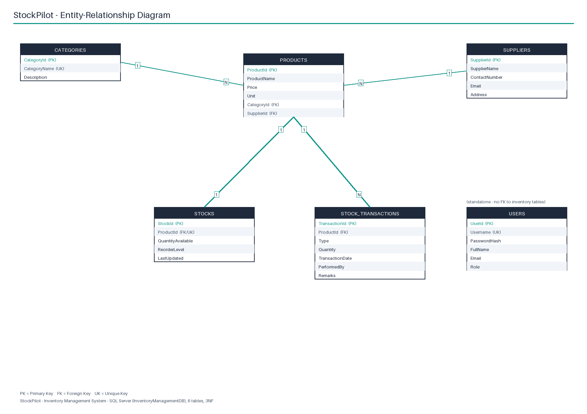

# ER Diagram — StockPilot (Inventory Management System)

This document describes the database design used by the ASP.NET Core MVC web
application (and shared, in simplified in-memory form, by the console
application). The database is SQL Server (`InventoryManagementDB`), created
either by Entity Framework Core's `EnsureCreated()`/table-creation fallback on
first run, or manually via `Database/SQLScripts/CreateTables.sql` and
`SeedData.sql`.

## Entity-relationship diagram

```mermaid
erDiagram
    CATEGORIES {
        int CategoryId PK
        nvarchar_100 CategoryName UK
        nvarchar_250 Description
    }
    SUPPLIERS {
        int SupplierId PK
        nvarchar_150 SupplierName
        nvarchar_20 ContactNumber
        nvarchar_150 Email
        nvarchar_250 Address
    }
    PRODUCTS {
        int ProductId PK
        nvarchar_150 ProductName
        decimal_10_2 Price
        nvarchar_20 Unit
        int CategoryId FK
        int SupplierId FK
    }
    STOCKS {
        int StockId PK
        int ProductId FK_UK
        int QuantityAvailable
        int ReorderLevel
        datetime2 LastUpdated
    }
    STOCK_TRANSACTIONS {
        int TransactionId PK
        int ProductId FK
        nvarchar_10 Type
        int Quantity
        datetime2 TransactionDate
        nvarchar_100 PerformedBy
        nvarchar_250 Remarks
    }
    USERS {
        int UserId PK
        nvarchar_50 Username UK
        nvarchar_256 PasswordHash
        nvarchar_100 FullName
        nvarchar_150 Email
        nvarchar_20 Role
    }

    CATEGORIES ||--o{ PRODUCTS : "has"
    SUPPLIERS ||--o{ PRODUCTS : "supplies"
    PRODUCTS ||--o| STOCKS : "tracked by"
    PRODUCTS ||--o{ STOCK_TRANSACTIONS : "moves via"
```

`USERS` has no foreign keys to the other five tables — login/session identity
is independent of the inventory data — so it is drawn as a standalone entity
in the rendered image below.

A rendered, print-friendly version (readable at A4) is also generated with
Pillow:



Regenerate it with:

```
tools/.venv/bin/python tools/build_docs.py
```

## Tables

Six tables, six normalized entities:

| # | Table | Purpose |
|---|-------|---------|
| 1 | `Categories` | Product category master (e.g. Groceries & Staples, Beverages) |
| 2 | `Suppliers` | Supplier master (contact + address) |
| 3 | `Products` | One row per catalog item; links to Category and Supplier |
| 4 | `Stocks` | Current quantity-on-hand and reorder level, one row per product |
| 5 | `StockTransactions` | Audit trail of every Stock In / Stock Out movement |
| 6 | `Users` | Login accounts for the web app (session-based auth) |

## Data dictionary

### Categories

| Column | Type | Constraints |
|---|---|---|
| CategoryId | int | PK, identity |
| CategoryName | nvarchar(100) | required, unique index |
| Description | nvarchar(250) | optional |

### Suppliers

| Column | Type | Constraints |
|---|---|---|
| SupplierId | int | PK, identity |
| SupplierName | nvarchar(150) | required |
| ContactNumber | nvarchar(20) | optional |
| Email | nvarchar(150) | optional, email format |
| Address | nvarchar(250) | optional |

### Products

| Column | Type | Constraints |
|---|---|---|
| ProductId | int | PK, identity |
| ProductName | nvarchar(150) | required, non-unique index |
| Price | decimal(10,2) | `CK_Products_Price`: >= 0 |
| Unit | nvarchar(20) | required, e.g. pcs, kg, L, pack |
| CategoryId | int | FK → Categories.CategoryId, `ON DELETE RESTRICT` |
| SupplierId | int | FK → Suppliers.SupplierId, `ON DELETE RESTRICT` |

### Stocks

| Column | Type | Constraints |
|---|---|---|
| StockId | int | PK, identity |
| ProductId | int | FK → Products.ProductId, unique index (one stock row per product), `ON DELETE CASCADE` |
| QuantityAvailable | int | `CK_Stocks_QuantityAvailable`: >= 0 |
| ReorderLevel | int | `CK_Stocks_ReorderLevel`: >= 0 |
| LastUpdated | datetime2 | defaults to current time on every stock change |

### StockTransactions

| Column | Type | Constraints |
|---|---|---|
| TransactionId | int | PK, identity |
| ProductId | int | FK → Products.ProductId, `ON DELETE CASCADE`, indexed |
| Type | nvarchar(10) | `CK_StockTransactions_Type`: IN ('StockIn','StockOut') |
| Quantity | int | `CK_StockTransactions_Quantity`: > 0 |
| TransactionDate | datetime2 | indexed, defaults to current time |
| PerformedBy | nvarchar(100) | required, username or staff name |
| Remarks | nvarchar(250) | optional, e.g. "Purchase – Supplier X", "Counter sale" |

### Users

| Column | Type | Constraints |
|---|---|---|
| UserId | int | PK, identity |
| Username | nvarchar(50) | required, unique index |
| PasswordHash | nvarchar(256) | required — ASP.NET Core Identity `PasswordHasher` (PBKDF2-SHA512) hash, never a plain-text password |
| FullName | nvarchar(100) | required |
| Email | nvarchar(150) | optional, email format |
| Role | nvarchar(20) | required, e.g. "Admin" |

The demo login seeded into `Users` is **`admin` / `Admin@123`** (the value
`Admin@123` is only ever stored hashed — `SeedData.sql` inserts a
pre-computed hash, and the application's own first-run seeder hashes it with
`IPasswordHasher<ApplicationUser>` before saving).

## Relationships

| Relationship | Cardinality | Delete behaviour | Why |
|---|---|---|---|
| Category → Product | 1 : N | Restrict | a category with products in it can't be deleted by accident; the app blocks the delete and reports how many products use it |
| Supplier → Product | 1 : N | Restrict | same reasoning — a supplier still in use can't be silently orphaned |
| Product → Stock | 1 : 1 (optional) | Cascade | a product's stock row is meaningless without the product; deleting the product cleans up its stock row automatically |
| Product → StockTransaction | 1 : N | Cascade | transaction history belongs to the product; deleting the product removes its history with it |

## Normalization (3NF) note

The schema is in Third Normal Form:

- **1NF** — every column holds a single atomic value (no repeating groups;
  e.g. a product's category and supplier are foreign keys, not comma-joined
  text).
- **2NF** — every table has a single-column surrogate primary key
  (`*Id`, identity), so there are no partial-key dependencies to worry about.
- **3NF** — no non-key column depends on another non-key column:
  - `CategoryName`/`Description` live only in `Categories`, not repeated on
    every `Product` row — that's why **Category is split out as its own
    master table** instead of being a free-text field on Product.
  - `SupplierName`/contact details live only in `Suppliers`, for the same
    reason — a **Supplier master table** avoids re-typing (and
    re-mistyping) the same supplier's phone/email on every product they
    supply.
  - `QuantityAvailable`/`ReorderLevel` are **split into their own `Stocks`
    table** rather than columns on `Products`, because they change on a
    different cadence (every Stock In/Out) than product identity data
    (name, price, unit). Keeping them together would force the same
    `Products` row to be rewritten on every stock movement and would mix a
    slow-changing catalog fact with a fast-changing operational fact.
  - `StockTransactions` is an append-only log — each row's `Quantity`/`Type`
    depend only on that transaction, not on the product's current stock
    level, so it is kept as its own table rather than derived columns
    somewhere else.

This also explains the delete rules above: Category/Supplier are reference
masters (Restrict — protect them from accidental deletion while referenced),
while Stock/StockTransaction are owned, dependent data (Cascade — they have
no meaning once their Product is gone).
